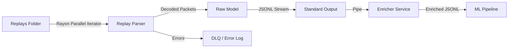

# Replay Parser: Design & Architecture

## 1. Overview
The **Replay Parser** is a specialized, high-performance Rust tool.
*   **Scope:** Extract **RAW** data from replays. No external lookups, no enrichment.
*   **Philosophy:** "Do one thing and do it well."
*   **Input:** `.wotreplay` files (optionally with CLI args for version/game to skip detection).
*   **Output:** **JSONL** (JSON Lines) stream to `stdout`.

## 2. Architecture: partial & piping
We separate the **Parsing** (I/O bound + CPU decode) from **Enrichment** (DB lookups). They connect via **Standard Streams (Pipes)**, which is compliant with the "Unix Philosophy" and extremely fast (memory-to-memory transfer).

```bash
# Example Workflow
./parser --batch-size 100 replays_folder/ | ./enricher | python train.py
```



### Components
1.  **Parser (Rust)**:
    *   **Rayon**: A Rust library for "Data Parallelism". It takes a list of 1 million files and automatically spreads the work across all CPU cores (e.g., 16 threads) with zero manual thread management.
    *   **Dead Letter Queue (DLQ)**: If a replay fails (corrupt/unsupported), its ID and error are written to `dlq.json` instead of crashing the stream.
2.  **Stream**: Bytes flow from Parser to Enricher via RAM. No SSD writes for intermediate data.

## 3. Data Format: JSONL (Streaming)
We use **JSONL** (one JSON object per line). This is ideal for streaming (line-by-line processing) and is natively supported by PyTorch/TensorFlow data loaders.

**Hybrid Structure (State + Events):**
We emit a stream of "Ticks". Events are embedded in the tick where they occurred.

```json
{"type": "header", "replay_id": "1", "game_version": "1.20", "identity": "T-34"}
{"type": "tick", "time": 0.1, "pos": [10, 20], "hp": 1500, "events": []}
{"type": "tick", "time": 0.2, "pos": [11, 21], "hp": 1500, "events": ["shot_fired"]}
{"type": "tick", "time": 0.3, "pos": [12, 22], "hp": 1400, "events": ["damage_received"]}
```

## 4. Performance Goals
*   **Throughput**: Target **>500 replays/second** (multithreaded).
    *   1M replays @ 500/sec = ~33 minutes.
*   **Batching**: The parser will process files in batches to amortize OS overhead.
*   **Zero-Copy**: Where possible, use Rust's zero-copy deserialization to read binary data without cloning it.

## 5. FAQ / Decisions
*   **Normalization inside Parser?** -> **No**. The parser provides raw values (HP: 1500). The *Enricher* or the *ML Dataset Loader* converts this to "1.0" (100%) or "0.05" (relative to team HP).
*   **Why Pipe?** It effectively allows the Parser (Rust) and Enricher (Elixir/Rust) to run in parallel on different cores, communicating at memory speed (~GB/s).
*   **Version Detection**: Can be overridden via CLI args for max speed if the dataset is pre-sorted.

### Why this format?
1.  **Sequential Nature**: The `timeline` array maps directly to the input sequence of an RNN/Transformer.
2.  **Stateful**: Each tick captures the complete state of the player, minimizing the need for the ML model to "remember" hidden state from too far back.
3.  **Sparse Support**: If data is missing (e.g., enemy position unknown), we can output `null`. ML frameworks handle masked values well.


## 5. Next Steps
1.  Initialize `replays-parser` as a Rust crate.
2.  Implement `VersionDetector`.
3.  Implement a basic `PacketStream` reader.
